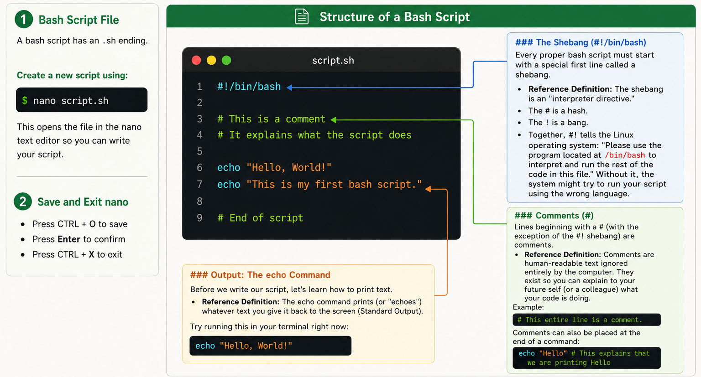

<p align="center">
  
</p>

---

# Bash Scripting & HPC Job Submission

::: {.callout-note}
## Overview & Learning Objectives
Up until now, you have been typing commands directly into the terminal one by one. This is excellent for exploring data and learning the basics, but it is not sustainable for real bioinformatics workflows where analyses must be repeated across dozens or hundreds of samples.

Today, we will learn how to bundle our commands into reusable **Bash scripts** that execute automatically from start to finish. Then, we will explore how to take those scripts and submit them as jobs on a High-Performance Computing (HPC) cluster using **Interactive sessions** (`srun` / `salloc`) and the **Slurm Workload Manager** (`sbatch`).
:::

---

## Part 1: Fundamentals of Bash Scripting

### What is a Bash Script?
A Bash script is simply a plain text file containing a sequence of Linux commands.
* **File Extension:** By convention, Bash scripts end with the `.sh` file extension (for example, `myscript.sh` or `pipeline.sh`). While Linux does not strictly require file extensions, using `.sh` immediately signals to you and your collaborators that the file is a shell script.
* **Creating a Script:** You can create and edit a script using any terminal text editor, such as `nano`:
  ```bash
  nano myscript.sh
  ```
A script acts as an automated recipe. When executed, the computer reads the file line-by-line from top to bottom and runs each command in order, exactly as if you were typing them into the terminal yourself. This guarantees **reproducibility** which is a fundamental requirement in scientific research.

---

### Anatomy & Structure of a Bash Script
Every well-written Bash script follows a clear structure composed of core components:

<p align="center">
  
</p>

---

### Writing and Running Your First Script

Let's build your very first standalone script!

1. Open a new file called `first_script.sh` using `nano`:
   ```bash
   nano first_script.sh
   ```
2. Type the following lines into the file:
   ```bash
   #!/bin/bash
   
   # ---description----
   # This is a welcome script to practice script execution
   # Usage: bash first_script.sh
   
   echo "========================================="
   echo "Welcome to the ABI Summer School 2026!"
   echo "This is my very first bash script."
   echo "========================================="
   ```
3. Save and exit `nano` (`Ctrl+O`, `Enter`, `Ctrl+X`).

#### How to Run a Bash Script

There are **three different methods** to execute your script:

**Method 1: Passing the file to `bash` directly**
You can explicitly tell the `bash` program to read and execute your script:
```bash
bash first_script.sh
```

**Method 2: Passing the file to `sh`**
`sh` is an older standard shell interpreter. For basic commands, it behaves similarly:
```bash
sh first_script.sh
```

**Method 3: Executing the file directly**
In professional environments, we run scripts directly as standalone programs using `./` (which specifies "look in the current directory"):
```bash
./first_script.sh
```

**Wait! You will see an error: `Permission denied`!**

Why did this happen? By default, Linux creates new text files with read and write permissions only. To prevent malicious or accidental execution, Linux requires you to explicitly grant **executable permissions** to any file you wish to run directly.

#### The `chmod` Command
* `chmod` stands for "Change Mode". It modifies file access permissions. The `+x` flag tells Linux to add executable rights to the file.

```bash
chmod +x first_script.sh
```

Now, try running Method 3 again:
```bash
./first_script.sh
```
It works! When executed this way, the operating system inspects the `#!/bin/bash` shebang on line 1, loads the Bash interpreter, and executes your instructions.

---

## Part 2: Running Computations on the HPC

### HPC Cluster Architecture: Login Node vs. Compute Nodes
When you log into a High-Performance Computing (HPC) cluster, you land on a **Login Node**. 

::: {.callout-warning}
## Login Node Rule
* **The Login Node:** A shared gateway server used by dozens of researchers at once. It is intended *only* for lightweight tasks: navigating directories, editing code with `nano`, and submitting jobs. **Never run computationally heavy analyses on the login node**, as doing so will slow down or crash the server for all users.
* **The Compute Nodes:** A massive fleet of high-powered servers (equipped with dozens of CPU cores and hundreds of gigabytes of RAM) where the actual computation takes place. Compute nodes cannot be accessed directly; tasks must be routed to them via a workload manager.
:::

---

### Three Ways to Execute Work on an HPC

There are three primary ways to run workloads on compute nodes:

```
┌─────────────────────────────────────────────────────────────────────────────────────────┐
│                                HOW WORK RUNS ON AN HPC                                  │
├───────────────────────────────┬───────────────────────────────┬─────────────────────────┤
│    1. DIRECT INTERACTIVE      │    2. ALLOCATION SUBSHELL     │      3. BATCH JOBS      │
│            (srun)             │           (salloc)            │        (sbatch)         │
├───────────────────────────────┼───────────────────────────────┼─────────────────────────┤
│ • Connects directly to node   │ • Reserves resources first    │ • Runs in background    │
│ • Live interactive shell      │ • Subshell on login node      │ • Fully automated       │
│ • Good for testing & EDA      │ • Good for multiple tasks     │ • Good for heavy runs   │
│ • Command: srun --pty bash    │ • Command: salloc ...         │ • Command: sbatch ...   │
└───────────────────────────────┴───────────────────────────────┴─────────────────────────┘
```

#### 1. Interactive Jobs (`srun`)
An interactive job allocates dedicated resources on a compute node and immediately gives you a live command prompt on that node in real time.
* **When to use:** Testing short commands, debugging scripts, or exploring data interactively.
* **Quick interactive session:**
  ```bash
  srun --pty bash
  ```
* **Custom resource request (e.g. 1 CPU core, 2GB RAM for 30 minutes):**
  ```bash
  srun --nodes=1 --ntasks=1 --cpus-per-task=1 --mem=2G --time=00:30:00 --pty bash
  ```
  *(Notice how your prompt changes from `user@login-node` to `user@compute-node`! When finished, simply type `exit` to return to the login node).*

#### 2. Interactive Resource Allocation (`salloc`)
While `srun` immediately runs a command on a compute node, `salloc` is used to **reserve and allocate resources** first. It opens a subshell with those resources held for you.

* **When to use:** When you need to hold a resource reservation for a work session and run several separate commands or `srun` tasks within that same allocation.
* **Example command (requesting 1 node, 2 CPUs, 4GB RAM for 1 hour):**
  ```bash
  salloc --nodes=1 --cpus-per-task=2 --mem=4G --time=01:00:00
  ```
  Once Slurm grants the allocation (`salloc: Granted job allocation ...`), you can run tasks inside it using `srun`:
  ```bash
  srun hostname
  ```
* **Releasing resources:** When finished, type `exit` to terminate the allocation and release the resources back to the cluster:
  ```bash
  exit
  ```

#### 3. Batch Jobs (`sbatch`)
A batch job is non-interactive. You write your instructions into a script, submit it to the scheduler, and disconnect. The cluster runs the script automatically in the background and saves all output to log files.
* **When to use:** Long-running computations, bioinformatics pipelines, and heavy analyses.

---

### What is Slurm?
* Slurm (Simple Linux Utility for Resource Management) is an open-source **Job Scheduler and Workload Manager**. It tracks cluster resources, manages user queues, and assigns batch jobs to available compute nodes.

### Slurm `#SBATCH` Directives
To tell Slurm what computational resources your script requires, we place `#SBATCH` headers at the top of the file immediately below the shebang.

| Flag | Purpose | Example |
| :--- | :--- | :--- |
| `--job-name` | A descriptive name for the job in the queue | `#SBATCH --job-name=my_job` |
| `--output` | File where standard output is saved | `#SBATCH --output=my_job.out` |
| `--error` | File where error messages are saved | `#SBATCH --error=my_job.err` |
| `--time` | Maximum runtime limit (`HH:MM:SS`) | `#SBATCH --time=00:05:00` |
| `--mem` | Total RAM requested | `#SBATCH --mem=1G` |
| `--cpus-per-task` | Number of CPU cores requested | `#SBATCH --cpus-per-task=1` |

---

### Practical 2 : Submitting Your First Slurm Batch Job

1. Create a job submission script called `hello_slurm.sbatch`:
   ```bash
   nano hello_slurm.sbatch
   ```
2. Type the following code:
   ```bash
   #!/bin/bash
   #SBATCH --job-name=hello_slurm       # Name of the job in the queue
   #SBATCH --output=hello_slurm.out     # Standard output log file
   #SBATCH --error=hello_slurm.err      # Standard error log file
   #SBATCH --time=00:05:00              # Maximum time requested (5 minutes)
   #SBATCH --mem=1G                     # Total RAM requested (1 GB)
   #SBATCH --cpus-per-task=1            # Number of CPU cores

   # --- Basic Commands ---
   echo "========================================="
   echo "Hello from the HPC cluster!"
   echo "Current working directory:"
   pwd
   echo "Current date and time:"
   date
   echo "Compute node hostname:"
   hostname
   echo "========================================="

   # Pause for 30 seconds so we can observe the job in the queue
   sleep 30

   echo "Batch job completed successfully!"
   ```
3. Save and exit `nano` (`Ctrl+O`, `Enter`, `Ctrl+X`).

#### Submitting and Monitoring the Job

4. **Submit the job to Slurm:**
   ```bash
   sbatch hello_slurm.sbatch
   ```
   *Slurm will confirm with a job number, e.g.: `Submitted batch job 104523`.*

5. **Inspect the queue:**
   Check the status of your running job (replace `<your_username>` with your cluster username):
   ```bash
   squeue -u <your_username>
   ```
   * *`ST` (State):* `PD` = Pending, `R` = Running, `CG` = Completing.

6. **View the generated output log:**
   Once the job finishes, check the generated output file:
   ```bash
   cat hello_slurm.out
   ```

---

### Practical 3: Diagnosing Broken Jobs & Using Error Logs

In bioinformatics, jobs frequently fail due to typos or missing files. Knowing how to read log files is essential.

1. Create a script with a deliberate typo:
   ```bash
   nano broken_job.sbatch
   ```
2. Type the following code:
   ```bash
   #!/bin/bash
   #SBATCH --job-name=broken_test
   #SBATCH --output=broken_test.out
   #SBATCH --error=broken_test.err
   #SBATCH --time=00:02:00
   #SBATCH --mem=1G

   echo "Starting my analysis..."
   
   # This command will fail because the folder does not exist:
   ls /non_existent_directory/data/
   
   echo "Analysis finished."
   ```
3. Save, exit, and submit:
   ```bash
   sbatch broken_job.sbatch
   ```
4. Check the error log:
   ```bash
   cat broken_test.err
   ```
   *You will see the exact cause of failure: `ls: cannot access '/non_existent_directory/data/': No such file or directory`.*

::: {.callout-important}
## Golden Rule of HPC Troubleshooting
Whenever a Slurm job fails or produces unexpected results, always inspect your `.err` file first (`cat broken_test.err`)!
:::

---

### Practical 4: Cancelling Active Jobs (`scancel`)

If you submit a job and realize you made a mistake, you can cancel it immediately to free up cluster resources:

1. Submit a job:
   ```bash
   sbatch hello_slurm.sbatch
   ```
2. Find the `JOBID` in the queue:
   ```bash
   squeue -u <your_username>
   ```
3. Cancel the job:
   ```bash
   scancel <YOUR_JOB_ID>
   ```

---

## Part 3: Dynamic Scripting - Variables, User Input & Command Substitution

Static scripts that only print fixed messages are of limited use. To build flexible data-analysis pipelines, our scripts must store data in variables, accept dynamic user input, and capture command outputs. We will practice each technique step-by-step by creating dedicated scripts.

---

### Step 1: Learning Variables

* **What is a Variable?** A named storage container in the computer's memory. You store data (like sample IDs, organisms, or file paths) inside the variable and recall it anywhere in your script.

::: {.callout-tip}
## Rules for Variable Assignment
1. Assign values using the equals sign `=`.
2. **CRITICAL:** There must be **NO SPACES** around the equals sign!
   * Correct: `SAMPLE="SAMPLE_001"`
   * Incorrect: `SAMPLE = "SAMPLE_001"` (Bash will mistakenly interpret `SAMPLE` as a command!)
3. To retrieve or evaluate the data stored inside a variable, prefix its name with a dollar sign `$`. Wrapping the name in curly braces `${VAR}` is standard best practice.
:::

#### Practical:
1. Open a new script with `nano`:
   ```bash
   nano variables_demo.sh
   ```
2. Type the following code:
   ```bash
   #!/bin/bash
   # ---description----
   # Demonstrating variable assignment and retrieval
   # Usage: bash variables_demo.sh

   # 1. Define variables (NO SPACES around =)
   ORGANISM="Plasmodium falciparum"

   # 2. Print variables using $ and ${}
   echo "========================================="
   echo "Target organism: ${ORGANISM}"
   echo "========================================="
   ```
3. Save and exit `nano` (`Ctrl+O`, `Enter`, `Ctrl+X`).
4. Run the script:
   ```bash
   bash variables_demo.sh
   ```

---

### Step 2: Interactive User Input with `read`

Hard-coding sample names directly into your script means you have to edit the file every time you process a new sample. We can make scripts dynamic by asking the user for input at runtime.

* The `read` command pauses script execution, waits for the user to type something on their keyboard, and stores whatever was typed directly into a variable.
* **The `-p` Flag:** Using `read -p "Prompt text: " VARIABLE` displays an inline prompt message to the user before waiting for their response.

#### Practical:
1. Open a new script:
   ```bash
   nano interactive_prompt.sh
   ```
2. Type the following code:
   ```bash
   #!/bin/bash
   # ---description----
   # Capturing dynamic user input with read
   # Usage: bash interactive_prompt.sh

   # Prompt the user for input interactively
   read -p "Enter your sample ID (e.g. Pf_001): " SAMPLE_ID

   echo "----------------------------------------"
   echo "Configuring pipeline for sample: ${SAMPLE_ID}"
   echo "----------------------------------------"
   ```
3. Save and exit `nano`.
4. Run the script and type in your sample details when prompted:
   ```bash
   bash interactive_prompt.sh
   ```

---

### Step 3: Command Substitution with `$()`

Often, you don't want to store static text or wait for user typing; you want to automatically capture the *live output* of a Linux command (such as the current date, active directory, or a file line count).

* Wrapping a Linux command inside `$(...)` executes that command first, captures its Standard Output, and substitutes that result into your variable.

#### Practical:
1. Open a new script:
   ```bash
   nano command_sub.sh
   ```
2. Type the following code:
   ```bash
   #!/bin/bash
   # ---description----
   # Demonstrating command substitution using $()
   # Usage: bash command_sub.sh

   # Capture dynamic system data using $()
   CURRENT_DATE=$(date)
   WORKING_DIR=$(pwd)

   echo "========================================="
   echo "Report generated on: ${CURRENT_DATE}"
   echo "Executed from folder: ${WORKING_DIR}"
   echo "========================================="
   ```
3. Save and exit `nano`.
4. Run the script:
   ```bash
   bash command_sub.sh
   ```

---

### Step 4: Putting It All Together — The Interactive System & Pipeline Reporter

Now let's synthesize variables, `read`, and `$()` into a complete, standalone utility.

1. Open a new file called `system_info.sh`:
   ```bash
   nano system_info.sh
   ```
2. Type the following code:
   ```bash
   #!/bin/bash
   # ---description----
   # Complete interactive pipeline summary reporter
   # Usage: bash system_info.sh

   # 1. Prompt the user for their name and sample name
   read -p "Please enter your analyst name: " USER_NAME
   read -p "Please enter the file to process: " FILE_NAME

   # 2. Capture system outputs using command substitution
   TODAY=$(date)
   CURRENT_DIR=$(pwd)
   HOST=$(hostname)

   # 3. Display the formatted summary report
   echo "=================================================="
   echo "PIPELINE EXECUTION REPORT"
   echo "=================================================="
   echo "Analyst:             ${USER_NAME}"
   echo "File Name:           ${FILE_NAME}"
   echo "Running on Machine:  ${HOST}"
   echo "Timestamp:           ${TODAY}"
   echo "Working Directory:   ${CURRENT_DIR}"
   echo "=================================================="
   ```

3. Save and exit (`Ctrl+O`, `Enter`, `Ctrl+X`).
4. Run the script directly as a program:
   ```bash
   bash system_info.sh
   ```

---

*ABI Summer School 2026 · Week 1: Linux / HPC*
