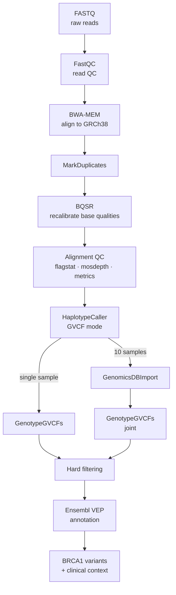

## Human NGS Read Alignment and Variant Calling: BRCA1 Tutorial

> **Why BRCA1?**
BRCA1 is a clinically important tumour-suppressor gene on chromosome 17. Restricting the analysis to the BRCA1 locus keeps runtimes and file sizes small while still demonstrating a real, end-to-end clinical-grade workflow.

---

## Table of contents

- [Overview](#overview)
- [Prerequisites](#prerequisites)
  - [Software](#software)
  - [Reference data (GRCh38)](#reference-data-grch38)
  - [Project layout & conventions](#project-layout--conventions)
  - [The BRCA1 interval](#the-brca1-interval)
- [Part 1 — Single sample](#part-1--single-sample)
  - [1. Raw-read QC](#1-raw-read-qc)
  - [2. Alignment](#2-alignment-bwa-mem)
  - [3. Mark duplicates](#3-mark-duplicates)
  - [4. Base Quality Score Recalibration (BQSR)](#4-base-quality-score-recalibration-bqsr)
  - [5. Alignment QC](#5-alignment-qc)
  - [6. Variant calling (HaplotypeCaller, GVCF mode)](#6-variant-calling-haplotypecaller-gvcf-mode)
  - [7. Single-sample genotyping](#7-single-sample-genotyping)
  - [8. Hard filtering](#8-hard-filtering)
- [Part 2 — Twenty samples (joint calling)](#part-2--twenty-samples-joint-calling)
  - [1. Per-sample GVCFs](#1-per-sample-gvcfs)
  - [2. Consolidate with GenomicsDBImport](#2-consolidate-with-genomicsdbimport)
  - [3. Joint genotyping](#3-joint-genotyping)
  - [4. Hard filtering (cohort)](#4-hard-filtering-cohort)
  - [5. Annotation with VEP](#5-annotation-with-vep)
  - [6. Extracting BRCA1 variants of interest](#6-extracting-brca1-variants-of-interest)
- [Cohort QC & evaluation](#cohort-qc--evaluation)
- [Interpreting BRCA1 variants](#interpreting-brca1-variants)
- [Appendix](#appendix)
  - [A. A note on VQSR](#b-a-note-on-vqsr)
  - [B. References](#c-references)

---

## Overview

The pipeline below is a GATK-based germline short-variant workflow. Each sample is processed independently up to the per-sample **GVCF**; the cohort is then jointly genotyped so that every sample is genotyped at every variant site discovered in any sample.

> For a full background on the Genome Analysis Toolkit, please refer to the [GATK Best Practices](https://gatk.broadinstitute.org/hc/en-us/sections/360007226651-Best-Practices-Workflows).



| Stage | Tool | Input → Output |
|-------|------|----------------|
| Read QC | FastQC / MultiQC | `FASTQ` → reports |
| Alignment | BWA-MEM, samtools | `FASTQ` → `BAM` |
| Duplicate marking | GATK MarkDuplicatesSpark | `BAM` → `BAM` |
| Recalibration | GATK BaseRecalibrator / ApplyBQSR | `BAM` → `BAM` |
| Per-sample calling | GATK HaplotypeCaller | `BAM` → `GVCF` |
| Consolidation | GATK GenomicsDBImport | `GVCF`s → GenomicsDB |
| Joint genotyping | GATK GenotypeGVCFs | DB → `VCF` |
| Filtering | GATK VariantFiltration | `VCF` → `VCF` |
| Annotation | Ensembl VEP | `VCF` → annotated `VCF` |

---

## Prerequisites

### Software

```bash
gatk4=4.5.0.0 
bwa=0.7.17 
samtools=1.19 
bcftools=1.19 
fastqc=0.12.1 
multiqc=1.21 

```

> **GATK & Java:** GATK4 ships its own wrapper (`gatk`) that launches the bundled JAR. It needs Java 17. The Spark-enabled tools (e.g. `MarkDuplicatesSpark`) can use multiple cores locally with `--spark-master local[N]`.

## Reference data (GRCh38)

In this tutorial, we'll be using the human reference and the GATK resource bundle on the Broad's Google bucket (https://console.cloud.google.com/storage/browser/gcp-public-data--broad-references/hg38/v0).

### Key files required by GATK

```
# Reference genome FASTA file and index files

Homo_sapiens_assembly38.fasta 
Homo_sapiens_assembly38.fasta.fai
Homo_sapiens_assembly38.dict
Homo_sapiens_assembly38.fasta.64.pac
Homo_sapiens_assembly38.fasta.64.sa
Homo_sapiens_assembly38.fasta.64.alt         
Homo_sapiens_assembly38.fasta.64.amb
Homo_sapiens_assembly38.fasta.64.ann

If the indexes are not already available, you can generate them using BWA (~1 hr for the whole genome)
bwa index Homo_sapiens_assembly38.fasta

# Known sites for BQSR
Homo_sapiens_assembly38.dbsnp138.vcf.gz
Homo_sapiens_assembly38.dbsnp138.vcf.tbi
Homo_sapiens_assembly38.known_indels.vcf.gz 
Homo_sapiens_assembly38.known_indels.vcf.gz.tbi
Mills_and_1000G_gold_standard.indels.hg38.vcf.gz 
Mills_and_1000G_gold_standard.indels.hg38.vcf.gz.tbi 
```

### Tutorial datasets
All datasets used in this tutorial can be found on the ACE HPC in `/etc/ace-data/ABI-SummerSchool-26/human-genomics/data/`


### Project layout & conventions

```text
brca1-vc/
├── ref/                      # reference + known sites (above)
├── fastq/                    # raw reads: <sample>_R1.fastq.gz, <sample>_R2.fastq.gz
├── qc/                       # FastQC / MultiQC / samtools depth outputs
├── bam/                      # aligned, dedup, recalibrated BAMs
├── gvcf/                     # per-sample GVCFs
├── vcf/                      # genotyped & filtered VCFs
├── annot/                    # VEP outputs
└── scripts/
```

Throughout, we use these shell variables:

```bash
REF=/etc/ace-data/genomics-resources/hg38/Homo_sapiens_assembly38.fasta
DBSNP=/etc/ace-data/genomics-resources/hg38/Homo_sapiens_assembly38.dbsnp138.vcf.gz
KNOWN_INDELS=/etc/ace-data/genomics-resources/hg38/Homo_sapiens_assembly38.known_indels.vcf.gz
THREADS=8
```

### The BRCA1 interval

BRCA1 is on the minus strand of chromosome 17 in GRCh38. We add ~3 kb of padding so we don't clip variants near the gene boundaries. Create an interval file once and reuse it:

```bash
# GRCh38 / hg38 coordinates for BRCA1 (GenBank gene span), with 3 kb padding
printf "chr17\t43041295\t43173327\tBRCA1\n" > ref/brca1.bed

# GATK also accepts the simple "contig:start-end" form on the command line:
BRCA1="chr17:43041295-43173327"
```

> **Coordinate note:** the BRCA1 gene body in GRCh38 spans roughly `chr17:43044295-43170327`. BED files are 0-based half-open, so the start is written as `43041295` after padding. Confirm against your annotation source if you need exact transcript boundaries.

We restrict expensive steps (variant calling) to this interval with `-L`. You could equally run the genome-wide pipeline and subset at the end — restricting early just makes the tutorial faster.

---


## Part 1 — Single sample

We'll process one sample called `HG02562`. Reads are paired-end: `fastq/HG02562_R1.fastq.gz` and `fastq/HG02562_R2.fastq.gz`.

```bash

R1=fastq/HG02562_R1.fastq.gz
R2=fastq/HG02562_R2.fastq.gz
```

### 1. Raw-read QC

Always look at your reads before aligning. FastQC flags adapter contamination, quality drop-off, and over-represented sequences.

```bash
mkdir -p qc/fastqc
fastqc -t ${THREADS} -o qc/fastqc ${R1} ${R2}
```

Inspect `qc/fastqc/*_fastqc.html`. Key panels:

- **Per-base sequence quality** — expect most bases in the green zone (Q ≥ 28). A tail-end drop is normal for Illumina.
- **Adapter content** — if adapters are present, trim with `fastp` or `cutadapt` before alignment.
- **Per-base sequence content** — random-primer libraries show wobble in the first ~10 bp; this is expected and is soft-clipped during alignment.

> We later aggregate every QC report into one dashboard with `multiqc qc/`.

### 2. Alignment (BWA-MEM)

Align reads to GRCh38 using BWA-MEM. The **read group** (`-R`) is mandatory for GATK — it records sample, library, and platform metadata.

```bash

# Create bam folder
mkdir -p bam

# Set read group information
RG="@RG\tID:HG02562.L1\tSM:HG02562\tLB:HG02562_lib1\tPL:ILLUMINA\tPU:FLOWCELL.L1"

# Align with BWA-MEM
bwa mem -t ${THREADS} -R "${RG}" ${REF} ${R1} ${R2} -o bam/HG02562.sam

# Convert SAM to BAM
samtools view -bS bam/HG02562.sam -o bam/HG02562.bam

# Sort BAM file
samtools sort -@ ${THREADS} bam/HG02562.bam -o bam/HG02562.sorted.bam

# Align and sort in one step:
bwa mem -t ${THREADS} -R "${RG}" ${REF} ${R1} ${R2} | samtools sort -@ ${THREADS} -o HG02562.sorted.bam

# Index BAM file
samtools index bam/HG02562.sorted.bam

# Confirm Coordinate sorting
samtools view -H bam/HG02562.sorted.bam | grep '^@HD'
```


| Read-group tag | Meaning |
|----------------|---------|
| `ID` | Unique read-group identifier (often flowcell + lane) |
| `SM` | **Sample** name — this is what propagates into the VCF column header |
| `LB` | Library (used by MarkDuplicates to detect PCR duplicates) |
| `PL` | Platform (`ILLUMINA`) |
| `PU` | Platform unit (flowcell.lane.barcode) |

### 3. Mark duplicates

PCR and optical duplicates inflate apparent depth and bias allele fractions. We **mark** (not remove) them so callers can ignore them.

```bash
gatk MarkDuplicatesSpark \
  -I bam/HG02562.sorted.bam \
  -O bam/HG02562.dedup.bam \
  -M qc/HG02562.dup_metrics.txt \
  --spark-master local[${THREADS}]
```

> `MarkDuplicatesSpark` also produces a coordinate-sorted, indexed BAM, so no separate `samtools index` is needed. If you prefer the non-Spark route, use Picard-style `gatk MarkDuplicates` followed by `samtools index`.

### 4. Base Quality Score Recalibration (BQSR)

Sequencers make systematic, machine-specific errors in their reported base qualities. BQSR builds an empirical model of these errors (excluding known variant sites, which are real differences, not errors) and adjusts the quality scores.

```bash
# Step 1: build the recalibration model
gatk BaseRecalibrator \
  -I bam/HG02562.dedup.bam \
  -R ${REF} \
  --known-sites ${DBSNP} \
  --known-sites ${KNOWN_INDELS} \
  -L ${BRCA1} \
  -O bam/HG02562.recal.table

# Step 2: apply it
gatk ApplyBQSR \
  -I bam/HG02562.dedup.bam \
  -R ${REF} \
  --bqsr-recal-file bam/HG02562.recal.table \
  -L ${BRCA1} \
  -O bam/HG02562.recal.bam
```

> **Why `-L` here?** Restricting to BRCA1 keeps the tutorial fast. In production you build the BQSR model genome-wide (the model benefits from more data) and apply it genome-wide too. Recalibrating on a single small gene is for demonstration only.

### 5. Alignment QC

```bash
# Quick mapping summary
samtools flagstat bam/HG02562.recal.bam > qc/HG02562.flagstat.txt

# Coverage over the BRCA1 region
samtools depth -r ${BRCA1} --threads ${THREADS} \
 bam/HG02562.recal.bam -o qc/HG02562.brca1.depth

# GATK metrics
gatk CollectAlignmentSummaryMetrics \
  -R ${REF} \
  -I bam/HG02562.recal.bam \
  -O qc/HG02562.aln_metrics.txt
```

What to check:

- **`flagstat`** — mapping rate should be high (typically >95% for WGS) and properly-paired reads should dominate.
- **`samtools depth`** — `qc/HG02562.brca1.depth` reports depth per position across BRCA1. For confident germline calls you want ≥20–30× across the region.
- **Duplicate rate** (from step 3) — single-digit percentages are typical; very high rates suggest a low-complexity library.

### 6. Variant calling (HaplotypeCaller, GVCF mode)

We run HaplotypeCaller in **GVCF mode** (`-ERC GVCF`). A GVCF records genotype likelihoods at *every* position — variant and non-variant — which is exactly what joint genotyping needs later. Even for a single sample we use GVCF mode so the same BAM slots straight into Part 2.

```bash
mkdir -p gvcf
gatk HaplotypeCaller \
  -R ${REF} \
  -I bam/HG02562.recal.bam \
  -L ${BRCA1} \
  -ERC GVCF \
  -O gvcf/HG02562.g.vcf.gz
```

> HaplotypeCaller does **local de novo reassembly** of each "active region": it builds a graph of candidate haplotypes from the reads, realigns reads to them, and computes genotype likelihoods. This is why it handles indels and complex regions far better than naive pileup callers.

### 7. Single-sample genotyping

To get a usable VCF for this one sample, genotype its GVCF:

```bash
mkdir -p vcf
gatk GenotypeGVCFs \
  -R ${REF} \
  -V gvcf/HG02562.g.vcf.gz \
  -L ${BRCA1} \
  -O vcf/HG02562.raw.vcf.gz
```

`vcf/HG02562.raw.vcf.gz` now contains raw SNVs and indels in BRCA1 for this sample. 

### 8. Hard filtering

With a single sample (and a small target) there isn't enough data for VQSR, so we use **hard filtering** — fixed thresholds on annotation values, applied separately to SNVs and indels because they have different error profiles. These thresholds are the GATK-recommended starting points; tune them against a truth set if you have one.

```bash
# --- SNVs ---
gatk SelectVariants -R ${REF} -V vcf/HG02562.raw.vcf.gz \
  --select-type-to-include SNP -O vcf/HG02562.snps.vcf.gz

gatk VariantFiltration -R ${REF} -V vcf/HG02562.snps.vcf.gz \
  --filter-expression "QD < 2.0"                 --filter-name "QD2" \
  --filter-expression "FS > 60.0"                --filter-name "FS60" \
  --filter-expression "MQ < 40.0"                --filter-name "MQ40" \
  --filter-expression "MQRankSum < -12.5"        --filter-name "MQRankSum-12.5" \
  --filter-expression "ReadPosRankSum < -8.0"    --filter-name "ReadPosRankSum-8" \
  --filter-expression "SOR > 3.0"                --filter-name "SOR3" \
  -O vcf/HG02562.snps.filtered.vcf.gz

# --- Indels ---
gatk SelectVariants -R ${REF} -V vcf/HG02562.raw.vcf.gz \
  --select-type-to-include INDEL -O vcf/HG02562.indels.vcf.gz

gatk VariantFiltration -R ${REF} -V vcf/HG02562.indels.vcf.gz \
  --filter-expression "QD < 2.0"                 --filter-name "QD2" \
  --filter-expression "FS > 200.0"               --filter-name "FS200" \
  --filter-expression "ReadPosRankSum < -20.0"   --filter-name "ReadPosRankSum-20" \
  --filter-expression "SOR > 10.0"               --filter-name "SOR10" \
  -O vcf/HG02562.indels.filtered.vcf.gz

# --- Merge back together ---
gatk MergeVcfs \
  -I vcf/HG02562.snps.filtered.vcf.gz \
  -I vcf/HG02562.indels.filtered.vcf.gz \
  -O vcf/HG02562.filtered.vcf.gz
```

Records that fail a filter keep the failed filter's name in the `FILTER` column; passing records show `PASS`. **VariantFiltration flags rather than deletes** — keep both so you can revisit borderline calls. To work with only the passing set:

```bash
bcftools view -f PASS vcf/HG02562.filtered.vcf.gz -Oz -o vcf/HG02562.pass.vcf.gz
bcftools index -t vcf/HG02562.pass.vcf.gz
```

| Annotation | What it measures | Why a variant might fail |
|------------|------------------|--------------------------|
| `QD` | Quality normalised by depth | Low-confidence calls in high-depth pileups |
| `FS` | Fisher strand bias (Phred) | Variant seen mostly on one strand → artifact |
| `SOR` | Strand-odds-ratio bias | Strand bias, complementary to FS |
| `MQ` | Root-mean-square mapping quality | Poorly mapped region |
| `MQRankSum` | Mapping-quality difference ref vs alt | Alt allele on worse-mapped reads |
| `ReadPosRankSum` | Position of allele within reads | Allele clustered at read ends → artifact |


## Part 2 — 20 samples (joint calling)

**Why joint calling?** Genotyping samples together (rather than merging single-sample VCFs) gives more accurate genotypes, correctly distinguishes homozygous-reference from no-data at each site, and produces a square matrix where every sample has a genotype at every variant site. This matters enormously for cohort and population analyses.

The key insight: **per-sample work stays per-sample** (steps from Part 1, producing one GVCF each); only the genotyping is joint.


```bash
# Create a sample sheet named samples.txt — with one sample name per line 

```

### 1. Per-sample GVCFs

Run the exact Part 1 pipeline (QC → align → dedup → BQSR → HaplotypeCaller `-ERC GVCF`) for each sample. A simple loop wraps the per-sample steps; in practice you'd use a workflow manager (Snakemake, Nextflow, WDL/Cromwell) to parallelise across samples and a cluster.

```bash
while read SAMPLE; do
  R1=fastq/${SAMPLE}_R1.fastq.gz
  R2=fastq/${SAMPLE}_R2.fastq.gz
  RG="@RG\tID:${SAMPLE}.L1\tSM:${SAMPLE}\tLB:${SAMPLE}_lib1\tPL:ILLUMINA\tPU:FLOWCELL.L1"

  bwa mem -t ${THREADS} -R "${RG}" ${REF} ${R1} ${R2} \
    | samtools sort -@ ${THREADS} -o bam/${SAMPLE}.sorted.bam -

  gatk MarkDuplicatesSpark -I bam/${SAMPLE}.sorted.bam \
    -O bam/${SAMPLE}.dedup.bam -M qc/${SAMPLE}.dup_metrics.txt \
    --spark-master local[${THREADS}]

  gatk BaseRecalibrator -I bam/${SAMPLE}.dedup.bam -R ${REF} \
    --known-sites ${DBSNP} --known-sites ${KNOWN_INDELS} \
    -L ${BRCA1} -O bam/${SAMPLE}.recal.table
  gatk ApplyBQSR -I bam/${SAMPLE}.dedup.bam -R ${REF} \
    --bqsr-recal-file bam/${SAMPLE}.recal.table -L ${BRCA1} \
    -O bam/${SAMPLE}.recal.bam

  gatk HaplotypeCaller -R ${REF} -I bam/${SAMPLE}.recal.bam \
    -L ${BRCA1} -ERC GVCF -O gvcf/${SAMPLE}.g.vcf.gz
done < samples.txt
```

You now have `gvcf/sample01.g.vcf.gz … gvcf/sample10.g.vcf.gz`.

### 2. Consolidate with GenomicsDBImport

`GenomicsDBImport` merges the per-sample GVCFs into a single GenomicsDB datastore, which scales far better than `CombineGVCFs` as sample counts grow. Build a sample map (sample name → GVCF path) and import over the BRCA1 interval:

```bash
# sample-name <TAB> path-to-gvcf
awk '{print $1"\tgvcf/$1.g.vcf.gz"}' samples.txt > cohort.sample_map

gatk GenomicsDBImport \
  --genomicsdb-workspace-path genomicsdb_brca1 \
  --sample-name-map cohort.sample_map \
  -L ${BRCA1} \
  --reader-threads ${THREADS}
```

> **Gotchas:** the workspace directory must **not already exist** (GenomicsDBImport creates it). To add samples later, use `--genomicsdb-update-workspace-path` instead of re-importing. For very large `-L` lists, add `--merge-input-intervals`.

> Prefer no database? `gatk CombineGVCFs -R ${REF} $(printf -- '-V gvcf/%s.g.vcf.gz ' $(cat samples.txt)) -L ${BRCA1} -O gvcf/cohort.combined.g.vcf.gz` produces a single combined GVCF you can feed to `GenotypeGVCFs` with `-V`. It's simpler but slower at scale.

### 3. Joint genotyping

Genotype the whole cohort in one shot. The output VCF has one column per sample and a row for every site variant in *any* sample.

```bash
gatk GenotypeGVCFs \
  -R ${REF} \
  -V gendb://genomicsdb_brca1 \
  -L ${BRCA1} \
  -O vcf/cohort.raw.vcf.gz
```

Quick sanity check on what came out:

```bash
bcftools stats vcf/cohort.raw.vcf.gz | grep -E "number of (records|SNPs|indels):"
bcftools query -l vcf/cohort.raw.vcf.gz   # should list all 20 samples
```

### 4. Hard filtering (cohort)

Identical strategy to the single-sample case — split by type, apply GATK-recommended thresholds, merge back. The thresholds are the same; only the input is the multi-sample VCF.

```bash
# SNVs
gatk SelectVariants -R ${REF} -V vcf/cohort.raw.vcf.gz \
  --select-type-to-include SNP -O vcf/cohort.snps.vcf.gz
gatk VariantFiltration -R ${REF} -V vcf/cohort.snps.vcf.gz \
  --filter-expression "QD < 2.0"              --filter-name "QD2" \
  --filter-expression "FS > 60.0"             --filter-name "FS60" \
  --filter-expression "MQ < 40.0"             --filter-name "MQ40" \
  --filter-expression "MQRankSum < -12.5"     --filter-name "MQRankSum-12.5" \
  --filter-expression "ReadPosRankSum < -8.0" --filter-name "ReadPosRankSum-8" \
  --filter-expression "SOR > 3.0"             --filter-name "SOR3" \
  -O vcf/cohort.snps.filtered.vcf.gz

# Indels
gatk SelectVariants -R ${REF} -V vcf/cohort.raw.vcf.gz \
  --select-type-to-include INDEL -O vcf/cohort.indels.vcf.gz
gatk VariantFiltration -R ${REF} -V vcf/cohort.indels.vcf.gz \
  --filter-expression "QD < 2.0"               --filter-name "QD2" \
  --filter-expression "FS > 200.0"             --filter-name "FS200" \
  --filter-expression "ReadPosRankSum < -20.0" --filter-name "ReadPosRankSum-20" \
  --filter-expression "SOR > 10.0"             --filter-name "SOR10" \
  -O vcf/cohort.indels.filtered.vcf.gz

# Merge + keep PASS
gatk MergeVcfs \
  -I vcf/cohort.snps.filtered.vcf.gz \
  -I vcf/cohort.indels.filtered.vcf.gz \
  -O vcf/cohort.filtered.vcf.gz
bcftools view -f PASS vcf/cohort.filtered.vcf.gz -Oz -o vcf/cohort.pass.vcf.gz
bcftools index -t vcf/cohort.pass.vcf.gz
```

### 5. Annotation with VEP

[Ensembl VEP](https://www.ensembl.org/info/docs/tools/vep/index.html) predicts the functional consequence of each variant and layers on clinical context. 

```bash
vep \
  --offline --cache --dir_cache $HOME/.vep \
  --fasta ${REF} --assembly GRCh38 \
  --input_file vcf/cohort.pass.vcf.gz \
  --output_file annot/cohort.vep.vcf.gz --vcf --compress_output bgzip \
  --everything --symbol --canonical --hgvs --pick \
  --custom file=clinvar.vcf.gz,short_name=ClinVar,format=vcf,type=exact,coords=0,fields=CLNSIG%CLNDN \
  --stats_file annot/cohort.vep_summary.html
```

Useful flags:

- `--everything` turns on a broad set of annotations (consequence, SIFT, PolyPhen, allele frequencies, etc.).
- `--hgvs` adds HGVS nomenclature (e.g. `BRCA1:c.68_69delAG`, `p.Glu23fs`) — the standard way clinicians refer to variants.
- `--pick` reports a single, prioritised consequence per variant (drop it to see all transcripts).
- `--custom ...ClinVar...` attaches ClinVar significance (`CLNSIG`) and disease name (`CLNDN`).

Pull out the most consequential variants for a quick look:

```bash
# Filter the VEP output to predicted high/moderate-impact variants
filter_vep \
  -i annot/cohort.vep.vcf.gz \
  --filter "IMPACT in HIGH,MODERATE and SYMBOL is BRCA1" \
  -o annot/cohort.brca1_impactful.vcf
```

### 6. Extracting BRCA1 variants of interest

A common task: list every clinically significant or high-impact BRCA1 variant and which samples carry it.

```bash
# (a) Restrict to clinically interesting consequences in BRCA1
filter_vep \
  -i annot/cohort.vep.vcf.gz \
  --filter "SYMBOL is BRCA1 and (IMPACT in HIGH,MODERATE or ClinVar_CLNSIG match pathogenic)" \
  -o annot/cohort.brca1_interesting.vcf

# (b) Tabulate carriers: position, HGVS, ClinVar, and per-sample genotypes
bcftools +split-vep annot/cohort.brca1_interesting.vcf \
  -f '%CHROM\t%POS\t%REF\t%ALT\t%SYMBOL\t%HGVSc\t%ClinVar_CLNSIG[\t%SAMPLE=%GT]\n' \
  -d -A tab > annot/cohort.brca1_table.tsv

column -t annot/cohort.brca1_table.tsv | head
```

`bcftools +split-vep` unpacks the VEP `CSQ` INFO field into usable columns; the `[\t%SAMPLE=%GT]` loop prints each sample's genotype so you can immediately see which individuals are heterozygous (`0/1`) or homozygous (`1/1`) for a given BRCA1 variant.

---

## Cohort QC & evaluation

Beyond per-sample alignment QC, evaluate the **variant call set** itself:

```bash
# Overall callset statistics (Ts/Tv, indel counts, per-sample metrics)
bcftools stats -s - vcf/cohort.pass.vcf.gz > qc/cohort.bcftools_stats.txt

# GATK's variant evaluation against dbSNP (novelty, Ts/Tv by novelty, etc.)
gatk VariantEval \
  -R ${REF} \
  --eval vcf/cohort.pass.vcf.gz \
  -D ${DBSNP} \
  -L ${BRCA1} \
  -O qc/cohort.varianteval.txt

# Roll EVERYTHING up into one HTML dashboard
multiqc qc/ annot/ -o qc/multiqc
```

Sanity checks for a healthy WGS germline callset:

- **Ts/Tv ratio** ≈ 2.0–2.1 genome-wide (higher, ~3, in exonic/coding regions like much of BRCA1). A value far from this suggests false positives.
- **Het/Hom ratio** per sample ≈ 1.5–2.0; an outlier sample may indicate contamination or a sample swap.
- **Missingness / depth** — flag samples with low mean depth over BRCA1.
- **Novelty** — most common variants should already be in dbSNP; a high novel fraction at a small locus warrants scrutiny.

---

## Interpreting BRCA1 variants

Calling and annotating are upstream of clinical interpretation, which is a regulated, expert-driven process. A few orientation points:

- **Pathogenic BRCA1 variants** are predominantly loss-of-function (frameshift indels, nonsense SNVs, canonical splice-site changes) that truncate the protein. VEP's `IMPACT=HIGH` consequences (`frameshift_variant`, `stop_gained`, `splice_donor/acceptor_variant`) are the first things to triage.
- **ClinVar** (`CLNSIG`) gives previously curated assertions, but always check the review status — single-submitter entries are weaker evidence than expert-panel ones. For BRCA1, the **ENIGMA** expert panel and the **BRCA Exchange** are authoritative resources.
- **Population frequency** (gnomAD) helps: a truly pathogenic BRCA1 variant is rare. A "variant" common in gnomAD is almost certainly benign or an artifact.
- Formal classification follows the **ACMG/AMP** guidelines (Pathogenic → Likely Pathogenic → VUS → Likely Benign → Benign), combining the evidence above with functional and segregation data.

> This pipeline identifies and annotates candidate variants. It does **not** make a clinical diagnosis — that requires review by qualified clinical scientists and orthogonal confirmation.

---

## Appendix

### A. A note on VQSR

We used hard filtering because **VQSR (Variant Quality Score Recalibration)** needs a large number of variants to train its Gaussian-mixture model — on the order of whole exomes or genomes with many samples. A single BRCA1 locus, even across 10 samples, has far too few variants. If you scale this pipeline up to genome-wide calling on a reasonable cohort, VQSR (`VariantRecalibrator` + `ApplyVQSR`) generally outperforms hard filtering. For modern pipelines, GATK's newer **VETS** (`ExtractVariantAnnotations` + `TrainVariantAnnotationsModel` + `ScoreVariantAnnotations`) is the supported successor and works on smaller callsets than classic VQSR. Hard filtering remains the robust, dependency-free default for small or targeted datasets like this one.

### B. References

- GATK Best Practices — Germline short variant discovery: <https://gatk.broadinstitute.org/hc/en-us/articles/360035535932>
- HaplotypeCaller in GVCF mode & joint genotyping: <https://gatk.broadinstitute.org/hc/en-us/articles/360035890411>
- Hard-filtering recommendations: <https://gatk.broadinstitute.org/hc/en-us/articles/360035890471>
- GATK Resource Bundle: <https://gatk.broadinstitute.org/hc/en-us/articles/360035890811>
- Ensembl VEP: <https://www.ensembl.org/info/docs/tools/vep/index.html>
- BRCA Exchange (curated BRCA1/2 variants): <https://brcaexchange.org/>
- ClinVar: <https://www.ncbi.nlm.nih.gov/clinvar/>

---

*This tutorial is for research and educational use. Clinical variant interpretation must be performed by qualified professionals using validated, accredited workflows.*
